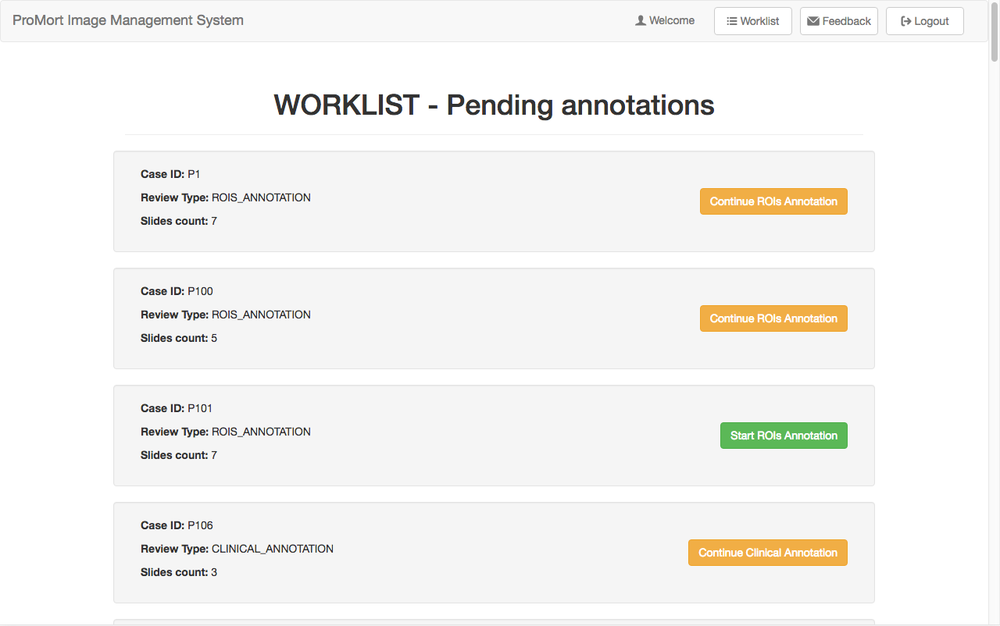

# Basic operations

## System Login

Users can access to the system simply by clicking on the “Login” button and inserting personal credentials on the form.

## Worklist

It is the very first page that the user sees after a successful login. Here, the application shows all the cases available to be reviewed and/or clinically annotated. Depending on the user, this page allows to:

- start/continue ROIs annotation (only ROIs Reviewers );
- start/continue Clinical annotation (both ROIs Reviewers and Clinical Reviewers).

The “Worklist” page can always be reached using the dedicated button on the top bar.  

## Send Feedback
Users can, from any point of the application, send a message to the system administrators to report any experienced problem or give a suggestion to enhance the interface or the workflow in relation to that specific page.

