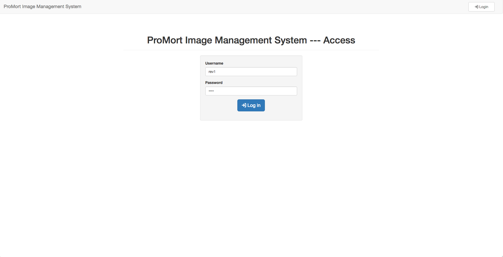
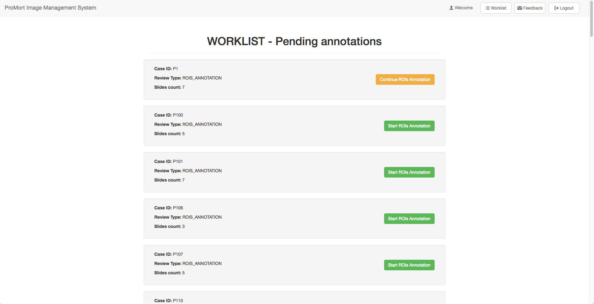
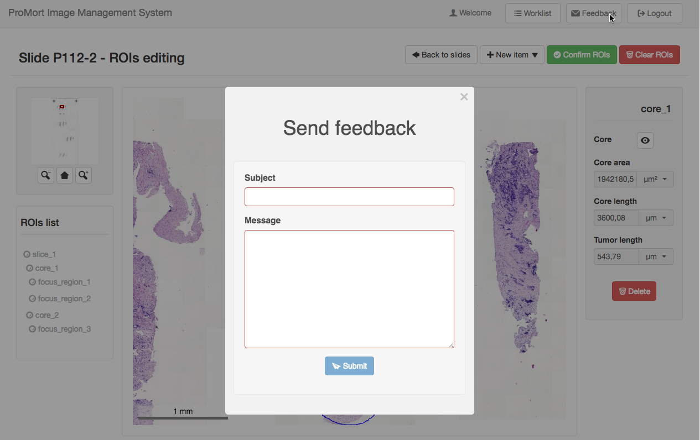

# Basic operations

## System Login

The user can access to the system simply by clicking on the “Login” button inserting personal credentials on the form.

## Worklist
The application shows all the cases available to be reviewed. Here the user can continue an already opened case ( yellow button ) or start to review a new one ( green button ). The “Worklist” page can be reached using the dedicated button on the top bar, it is also the page that will be shown to the user after a successfull login.  

## Slide list
By clicking on the “Start Review” or “Continue Review” button on the “Worklist” page, the user is taken to the “Slides” page which shows all the slides related to the selected case. Reviews can be initiated (yellow button), closed in case of poor quality images ( grey button ) or not commenced yet (green button).

&nbsp;

## Send feedback
The user can, from any point of the application, send a message to the system administrators to report any experienced problem or give a suggestion to enhance the interface or the workflow in relation to that specific page.

