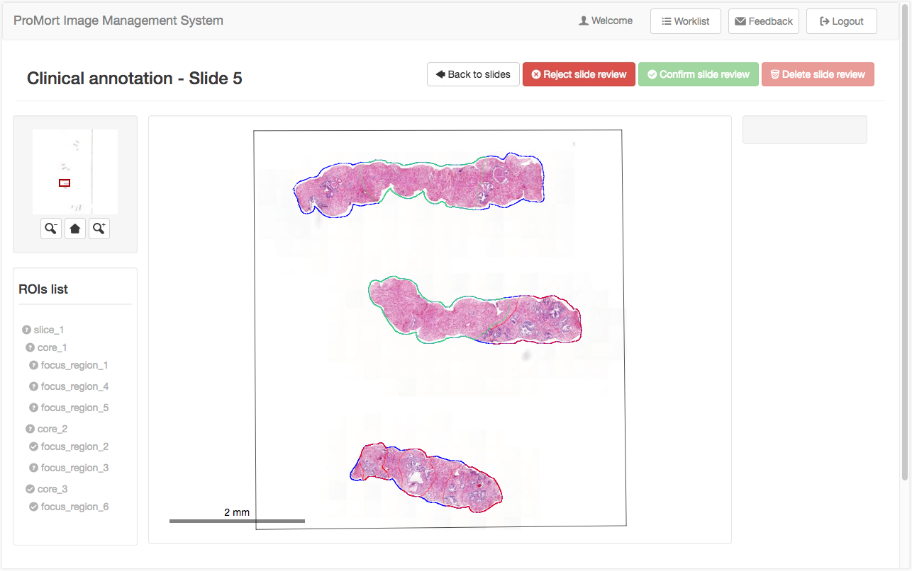
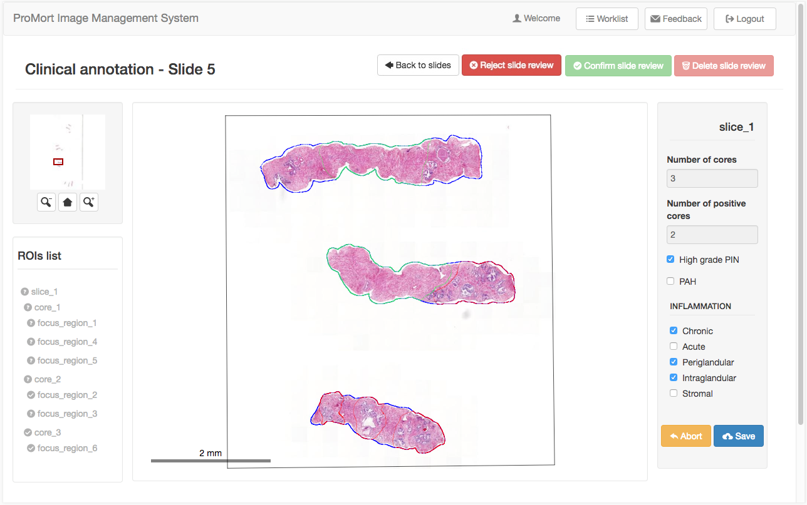
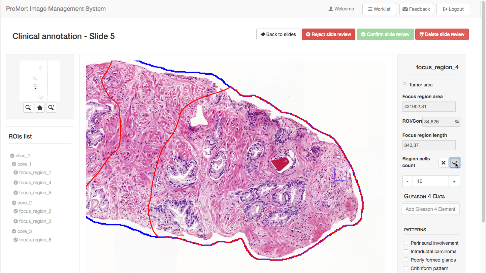
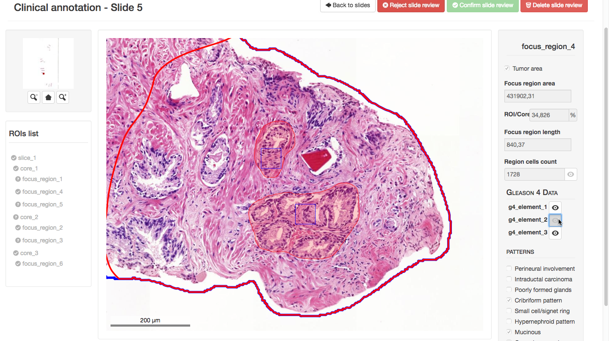

# ROIs clinical annotation 

## Slides list - Clinical annotation
This page gives the list of the pending clinical annotation for a specific case. The only available slides for clinical review have a green button beside, while the others have a grey label to says that the clinical review is closed. This happens both for already closed review and for slides marked as bad quality images.

## Clinical annotation
The page for the clinical annotation maintains the same structure used for the editing phase. In the left side there is a tree of the ROIs that allows the user to:

* select a ROI among those which present the "**?**" icons to annotate them;
* jump quickly from one annotated region to another (that ones with the “✔” icon) and view the data in the form on the right side of the page. 

## Clinical annotation: slices
The form for the annotation of a clinical slice contains some information derived automatically from the editing phase followed by a list of clinical observation to be checked if present. Note that the form has no constraints, so it can be also saved empty. 

After completing the annotation phase, the icon beside the slice name in the ROIs tree becomes “✔ and the slice is easily selectable to view the data in the annotation form.

## Clincal annotation: cores
First of all, the form shows some read-only data about the geometry of the ROI (coming from the previous editing phase). The only clinical annotations here regards the  grading system for the tumor classification, and these are present and mandatory only in case of positive core. Note that the Grade Group WHO is automatically derived from the inserted Gleason grades.

In addiction, the form in the view-only mode, contains:

* a field that indicates the percentage of the normal tissue;
* a field named "Gleason pattern 4" which shows the percentage of that pattern on the core. 

Note that the latter is initially empty because it is a quantity derived from the subsequent annotation of the tumoral focus region.  

## Clincal annotation: focus regions with tumor
The form for the annotation of the focus region contains the main part of the whole clinical annotation together with some useful tools. Like the slice form, it can be saved empty (all the fields are optional) and shows firstly the geometric characterization of the region. 

## Region cells count
The counter tool is used to estimate the cells quantity inside the region. The user clicks and drags a box with a fixed dimension (50µm) in the viewer. Then, he/she counts the cells that lie inside the box and insert the number in the input field. After confirming the value (clicking the  “✔” button), the application estimate the quantity of the cells in the whole focus region and shows the calculated number.  

## Gleason 4 data
The user can put in evidence a region with a Gleason 4 pattern using the "Drow region" button inside the Gleason 4 data section. The tool works the same as the freehand drawing tool of the ROIs editing phase: if the user draws outside the focus region, the application simply save the intersection between the two. The region is showd in a pale red color. A **video tutorial** for this operations is available [here](./video_page.html).

The cell counter tool is available also for the Gleason pattern 4 area.

In the read-only mode of the focus region both the cells counter boxes and the Gleason 4 area can be turned off/on using the corresponding eye-buttons.

## Gleason 4 percentage in the core
Note that after the saving of a focus region that contains a Gleason 4 area, the form of the parent core is updated to show the percentage of that area.

## Clincal annotation: regions without tumor
If the focus region is marked as a non-tumoral region, the form is in read-only mode and it displays only the geometric characteristics of rhe ROI. The same happens also for a core that does not contain a tumoral region inside.

## Delete slide review
The red button in the upper right corner of the page deletes all the clinical annotations made bringing the user to the initial state. Not that this operation is not reversibile.  

## Confirm slide review
The green button in the upper right corner of the page is to confirm and close the annotation step for the current slide. After that, the user won't be able to edit the annotation animore.

