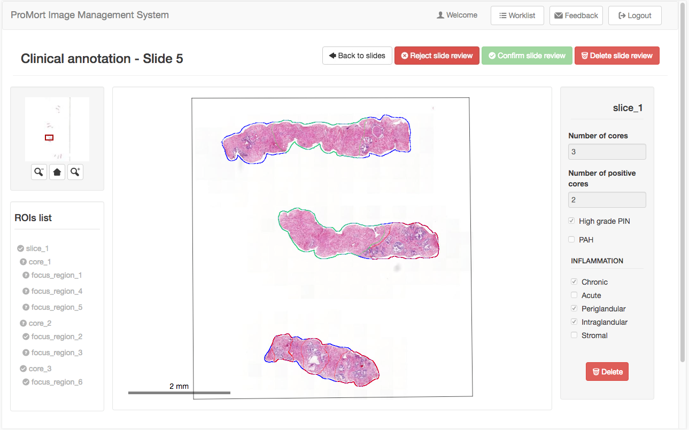
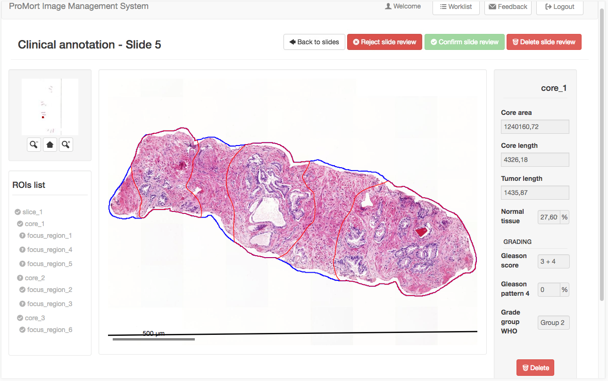
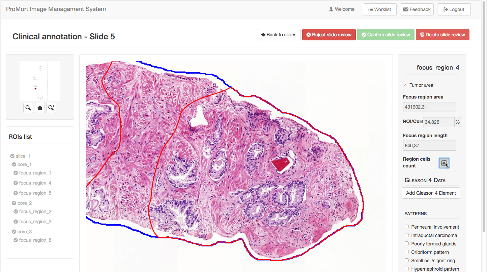
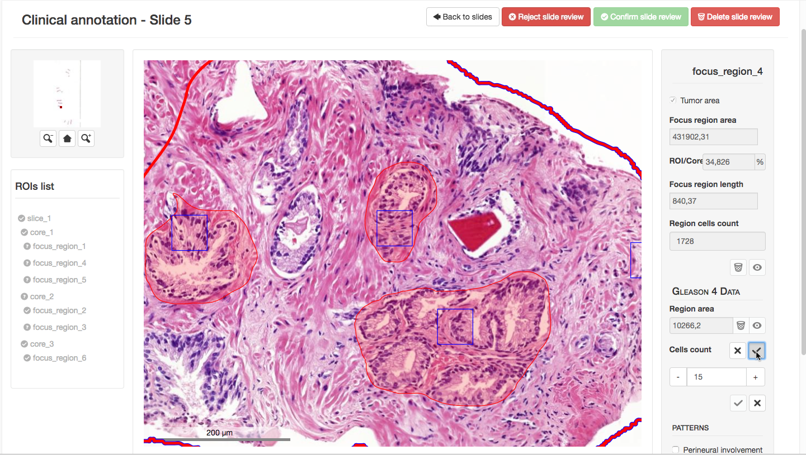

# ROIs Clinical Annotations 

## Audience
This section of the tutorial is addressed to both the ROIs Reviewers and the Clinical Reviewers).

## Worklist
In the worklist page, pending Clinical Annotations have one of these buttons beside:

- "Start Clinical Annotation" (green), when all the slides of the case are marked as good;
- "Continue Clinical Annotation" (yellow), when there exist some bad quality images in the case.

By clicking one of those buttons, users can access to the Clinical Annotations phase.

## Clinical Annotation Steps
This page gives the list of the clinical annotation steps for the specific case. The only available slides for clinical review have a green button beside, while the others have a grey label to says that the clinical review is closed. This happens both for already closed review and for slides marked as bad quality images.

[ROIs Reviewer]: Only the reviewer who did the ROIs Annotation phase for that specific case is allowed to reopen the ROIs Review through the red button that says "Reopen ROIs review".

❗ The Reopen operation is available **only if** any Clinical Annotation for that slide has been started yet by a Clinical Reviewer. Note that reopening the Review Step will **irreversibly delete** any Clinical Annotation data for that specific slide.

## Clinical Annotation
The page for the clinical annotation maintains the same structure used for the editing phase. In the left side there is a tree of the ROIs that allows the user to:

* select a ROI among those which present the "**?**" icons to clinically annotate them;
* jump quickly from one annotated region to another (that ones with the “✔” icon) and view the data in the form on the right side of the page. 

## Reject Slide Review
The red "Reject slide review" button in the upper right corner of the page is to reject and close the Clinial annotation step for the current slide. The Clinical Reviewer can use this option if he/she believes that the ROIs Review is not adequate to perform the clinical evaluation. This button is always available during the clinical review phase, and it generates a pop-up where the User shall specify a reason and, optionally, add comments.

❗ This operation is **irreversible**.

## Slices
The form for the annotation of a clinical slice contains some information derived automatically from the editing phase followed by a list of clinical observation to be checked if the clinical condition is present. Note that the form has no constraints, so it can be also saved empty. 

After completing the annotation phase, the icon beside the slice name in the ROIs tree becomes “✔ and the slice is easily selectable to view the data in the annotation form.

## Cores
The form shows some read-only data about the geometry of the ROI (coming from the previous editing phase) and, if it is a tumor-positive core, it allows also the clinical evaluation. The User shall classify  the tumor with the Gleason grading system while the Grade Group WHO is automatically derived from the inserted Gleason grades. 

Any clinical data is required for negative cores which can be, however, viewed in a read-only mode. 

The completed form contains in addiction:

* a field that indicates the percentage of the normal tissue;
* a field named "Gleason pattern 4" which shows the percentage of that pattern on the core. 

Note that the latter is initially empty because this quantity is derived from the subsequent annotation of the tumoral focus region.  

## Focus Regions 
The form for the annotation of the focus region contains the main part of the whole clinical annotation together with some useful tools. Like the slice form, it can be saved empty (all the fields are optional) and shows firstly the geometric characterization of the region. 

Any clinical data is required for negative focus region which can be, however, viewed in a read-only mode.

## Region Cells Count
The counter tool is used to estimate the cells quantity inside the region. The user clicks and drags a box with a fixed dimension (50µm) in the viewer. Then, he/she counts the cells that lie inside the box and insert the number in the input field. After confirming the value (clicking the  “✔” button), the application estimate the quantity of the cells in the whole focus region and shows the calculated number. 

## Gleason 4 Data
The user can put in evidence multiple regions of Gleason pattern 4 inside the Focus Region by adding one or more Gleason 4 Element. The User shall add a region of pattern 4 using the "Draw region", a tools that works the same as the Freehand-drawing tool of the ROIs editing phase. The region is shown in a pale red color. The User shall also specify a cellular density of this subregion through the cell counter tool. 

A **video tutorial** for this operations is available [here](./video_page.html).

In the read-only mode of the focus region both the cells counter boxes and the Gleason 4 area can be turned off/on using the corresponding eye-buttons.

## Gleason 4 Percentage in the Core
After saving a focus region that contains Gleason 4 area(s), the form of the parent core is updated to show the percentage.

## Negative ROIs
Except for the slice, all the tumor-negative ROIs can be viewed as soon as the Clinical Annotation Step start by selecting them in the ROIs list. Any clinical information is required to the User for negative cores and focus regions. 

## Delete a single ROI Clinical Review
When a ROI is selected, it can be deleted with the “Delete” button under the clinical annotation form.

❗ This operation is **irreversible**.
  

## Delete Slide Clinical Review
The red "Delete slide review" button in the upper right corner of the page deletes all the clinical annotations made bringing the user to the initial state. 

❗ This operation is **irreversible**.
  

## Confirm Slide Clinical Review
The green "Confirm slide review" button in the upper right corner of the page is to confirm and close the Annotation Step for the current slide. This operation is available only if all the ROIs have been annotated (i.e. they all have the “✔” icon beside in the ROIs list). After confirming that, the user won't be able to edit the annotation anymore. Before moving on, the User can type a comment for the review step. 

❗ This operation is **irreversible**.

