# ROIs editing

## Preliminary review
When opening for the first time a Slide, user will perform a Preliminary review on the image. From this point on, the user can navigate on the viewer and zoom in/out to see the full details of the slide using the navigation panel. He/she has to specify the type of staining (choosing among the options) and a quality evaluation. If the quality of the image is considered not good enough to perform the analysis, the user must select a reason and, optionally, add notes. In that case, by saving, the review of the current slide is closed and the user will be redirected on the slide list page. If the quality is good, the user will be redirected to the ROIs editing page.  
Note that, if the image does not have a good quality but the user still wants to go ahead with the analysis, he/she can do it by selecting the "Good quality" button and, preferably, adding a comment to explain that.

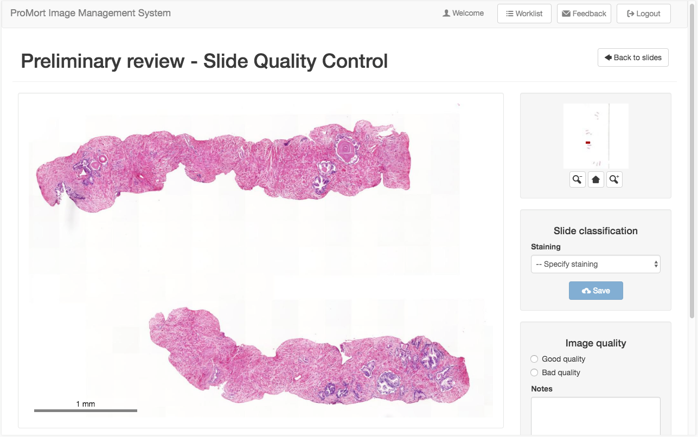

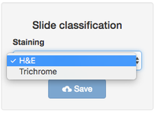
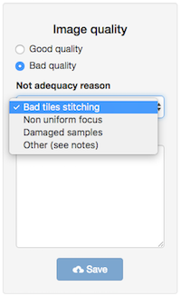

&nbsp;

## ROIs editing

After the Preliminary Review is completed and only if the images was marked as “Good” user can access the interface of the ROIs editing mode. He\she can navigate on the image, see the already created ROIs (in the ROIs list block), create new ROIs, clear all the existing ones or confirm to close the drawing step (see details below).

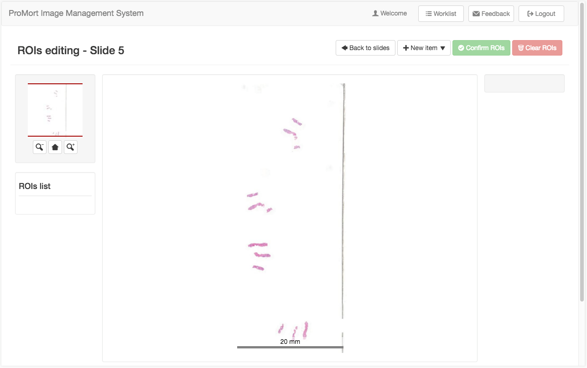

&nbsp;

## New slice - polygon-drawing tool
To add a ROI, the user can click on the "New item" menu and choose one of the options (only a slice if it is the very first ROI). To draw the shape, the user can choose among the polygon-drawing tool (shown as example in the figures) and the freehand one. To use the polygon-drawing tool simply drop points on the image and confirm with the “ ✔ ” button after the desired shape has been completed. Alternatively, the shape can be discharged with the “ ✗ ” button if the user is not satisfied with it. Then, add the number of cores and save the ROI, which will be added to the ROIs list in the left side. The eye button is to center and adapt the ROI to the viewer. The same functionality can be obtained by clicking on a ROI from the ROIs list.

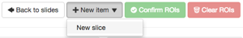

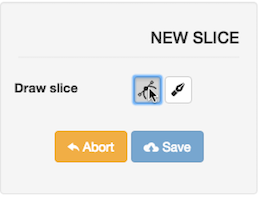
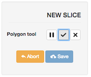
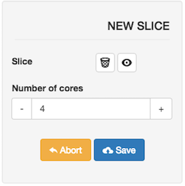

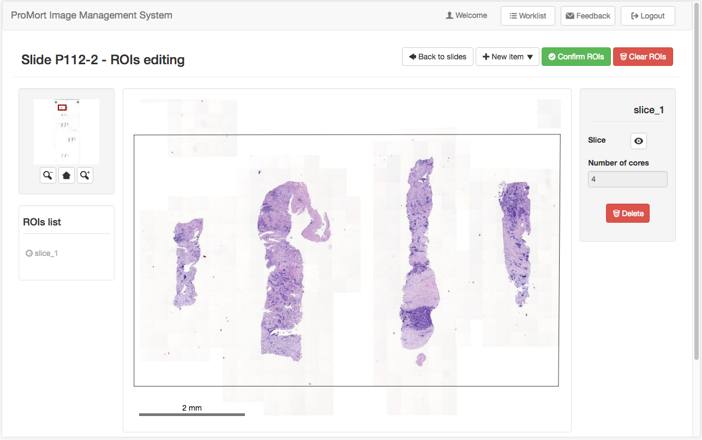

&nbsp;

## New core - freehand-drawing tool
The procedure is the same seen for the slice. As an example, here is used the freehand-drawing tool that can be activated by clicking on a point of the viewer and keeping the mouse pressed dragging it until the shape is completed. Releasing the mouse will create the shape and automatically accept it. Note that a new core can be added only if at least one slice is already present and it must be, even partially, contained inside a slice.

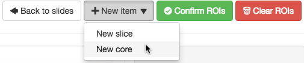
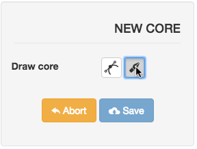

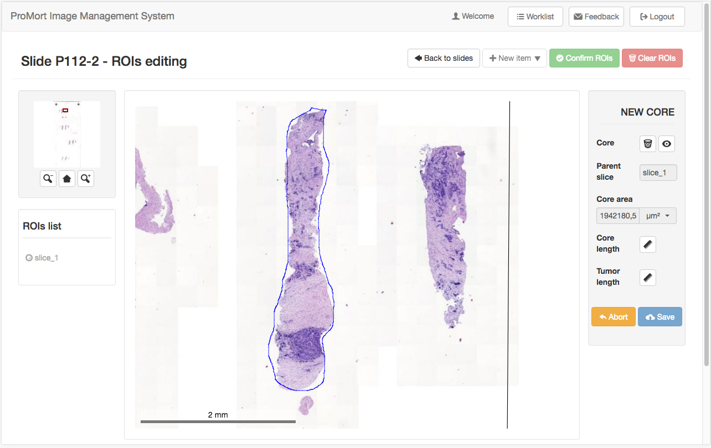

&nbsp;

## Error message
The system discharges core ROIs that are entirely otuside the perimeter of a slice. In that case, a pop-up with an error message will be displayed to inform the user. Otherwise, if the shape is partially contained inside the slice, only the intersection will be maintained. The system will behave the same for focus region drawn partially outside a core (see below an example).  

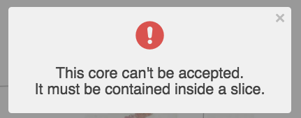

## Ruler tool
To get the measure of the core length the user can drop points like he/she does using the polygon-drawing tool. By accepting the polyline with the “✔” button, the measure will be recorded. Ruler tool can also be deactivated with the “✗” button. The core ROI can be saved only if its measure exists.

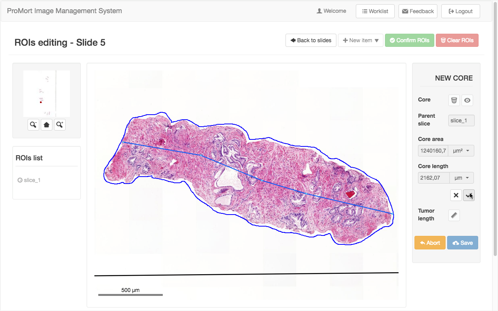

Optionally, the user can get the measure of the tumor (if present) in the same way using the ruler tool for the tumor length.

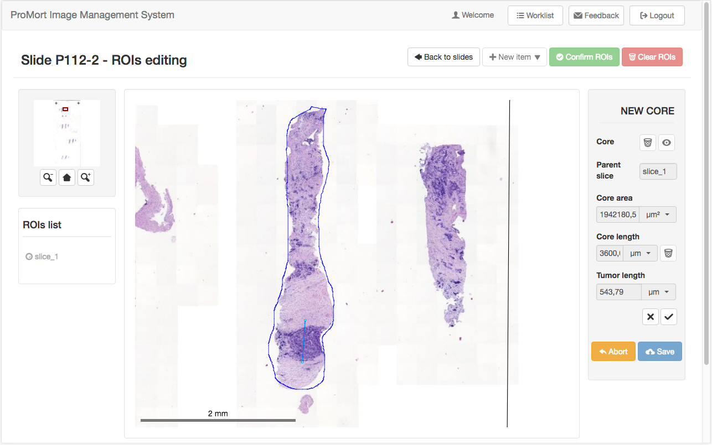

For each measure, the user can change the unity of measure (millimetres or micrometres) through the drop-down menu beside the value. 

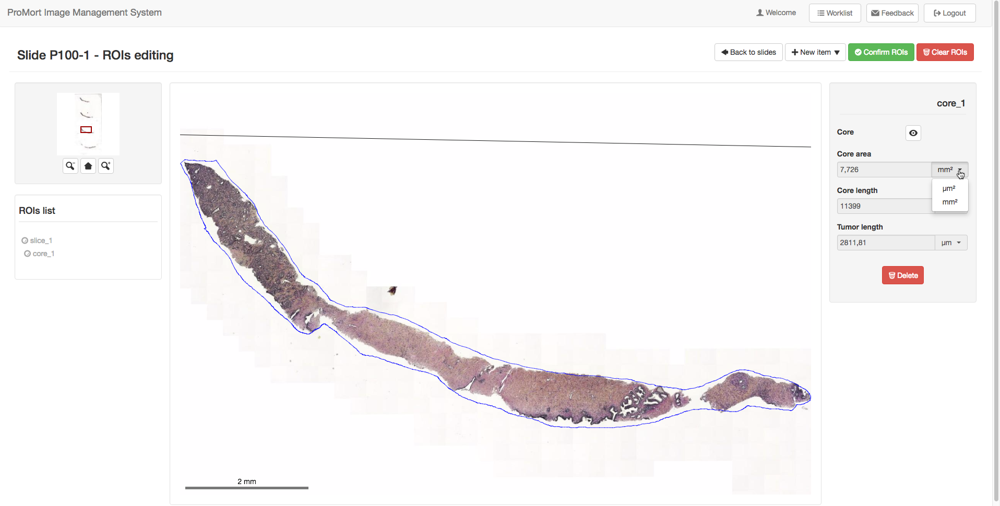

&nbsp;

## New focus region
The user can add a focus region just like he/she did with the core. Note that a focus region can be added only if at least a core exists and it must be drawn inside a core to be accepted.

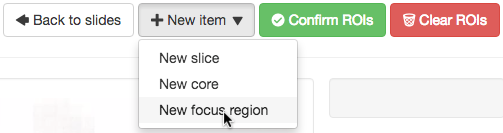
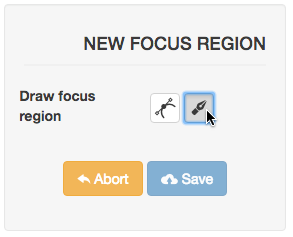

If the focus region is drawn partially outside the core, the system automatically save only the intersection of the shapes.

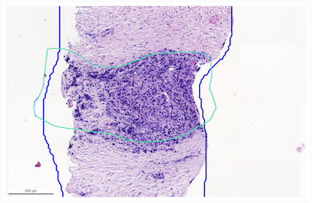
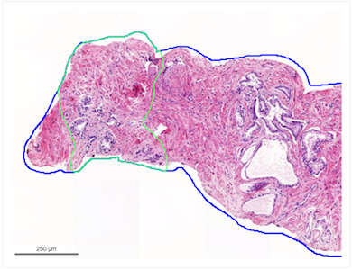

The user has to measure the length of the region with the ruler tool and can specify if it is a tumor region with the check button. Tumor regions are drawn in red while non-tumor regions are green.

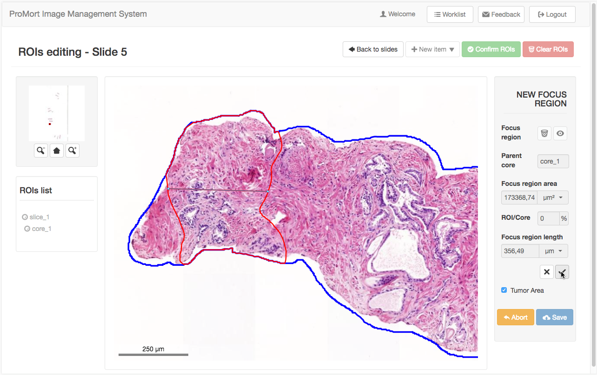 	

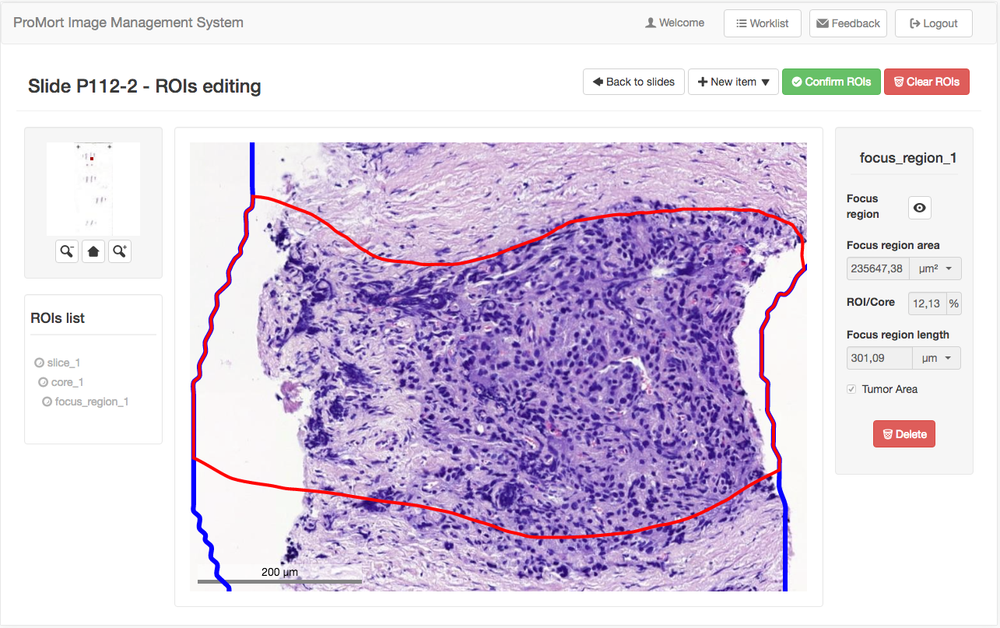

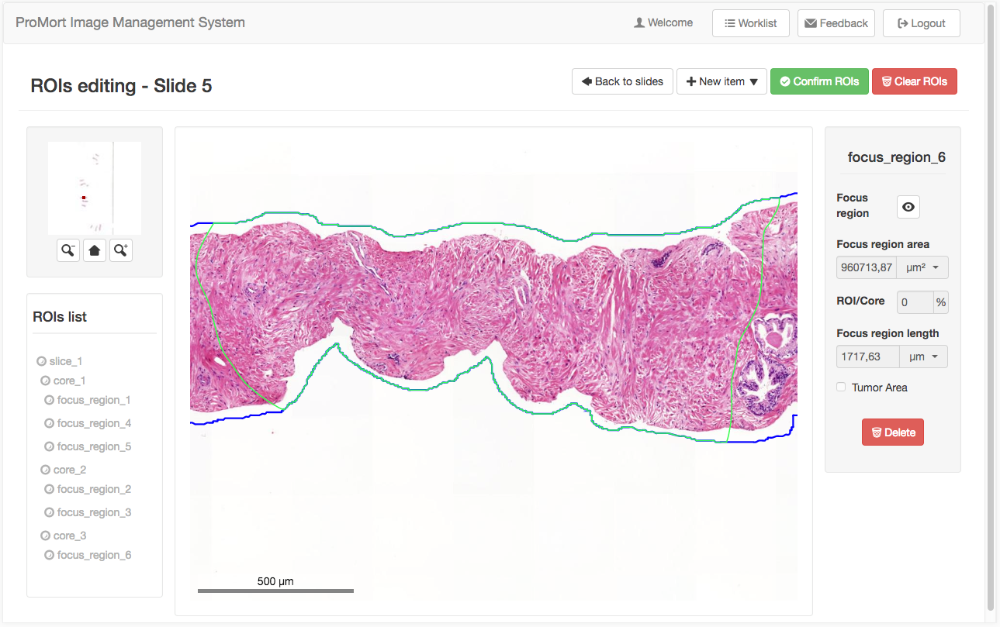

&nbsp;

## ROIs list
The list of the ROIs is automatically populated every time the user add a new region of interest. This panel is useful to jump quickly from a ROI to another one, display it centered and adapted to the viewer and read the related annotations.

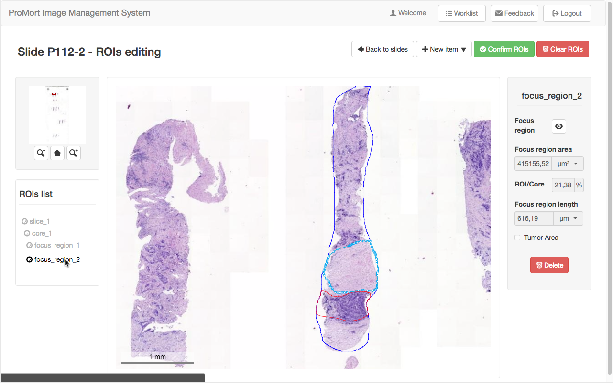

&nbsp;

## Delete a single ROI
When a ROI is selected, it can be deleted with the “Delete” button, but the user should be careful because the system implements a “cascade” deleting. It means that if the ROI is a slice, also any contained core or focus region will be deleted. The same happens if the ROI is a core: all the focus region children will be deleted too. The delete process is irreversible.

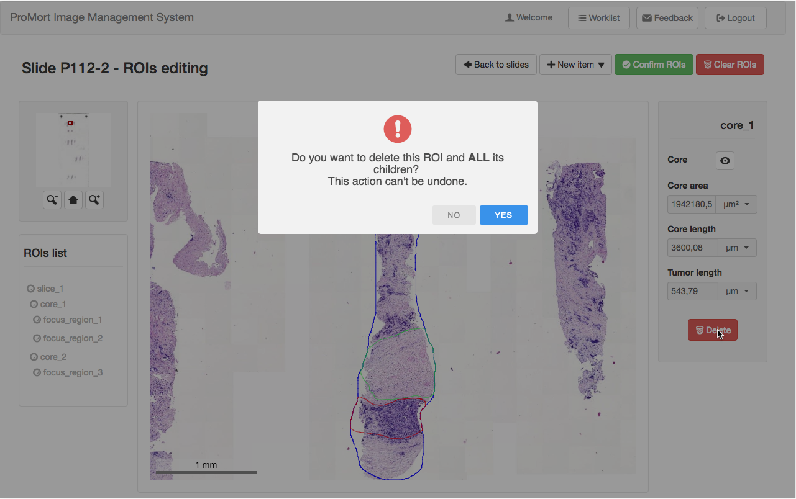

&nbsp;

## Clear all the existing ROIs
In the top-right corner, the “Clear ROIs” button is to delete at the same time all the existing ROIs. The user will be warned with a pop-up that this operation is irreversible.  

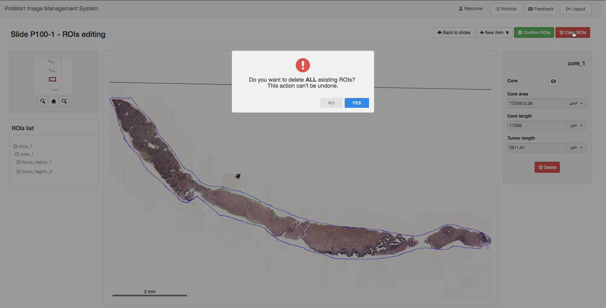 

&nbsp;

## Confirm ROIs

By confirming the ROIs the user closes the editing phase, and he/she will be redirect to the worklist containing the pending annotations to proceede. This button becomes available only if at least a ROI has been added. Like the Clear and the Delete functions, the process can't be undone. 

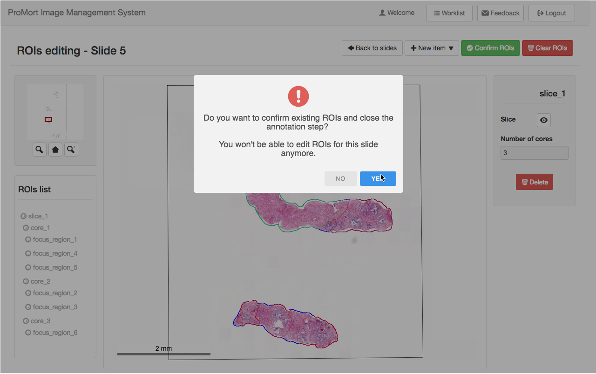

In the worklist the user can find a button beside the case that says "Start clinical annotation" (this happens when all the slides of the case are marked as good) or "Continue clinical annotation" (when there exist some bad qality images in the case). The former is green while the latter is yellow.

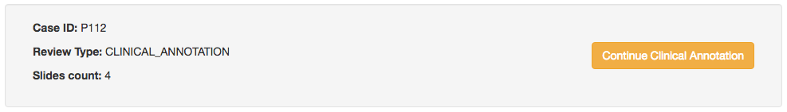
